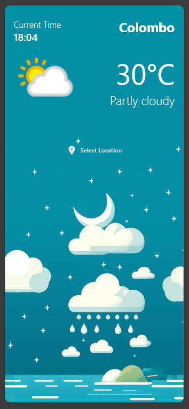
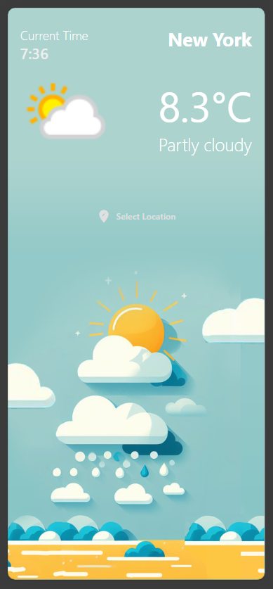
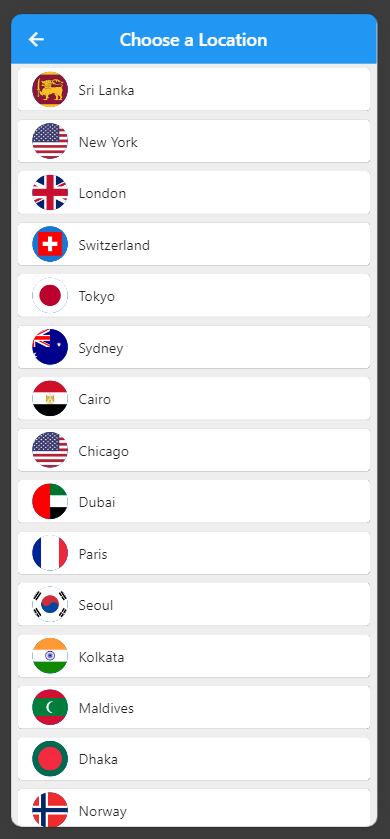

# Flutter Weather App

## Overview

This Flutter Weather App allows users to check the current weather in different countries. <br>
The app displays the weather information, including temperature, weather type, and the current time. <br>
The weather data is fetched using the [WeatherAPI](https://www.weatherapi.com/) for free API access.

## Features

- **Weather Information:** Get real-time weather updates for selected locations.
- **Current Time:** View the current time along with the weather details.
- **User-friendly Interface:** Easy-to-use interface with options to choose different locations.

## Screenshots
      

## Usage

1. **Clone the Repository:**
   ```bash
   git clone https://github.com/dinithmaleesha/flutter-weather-app.git
  
